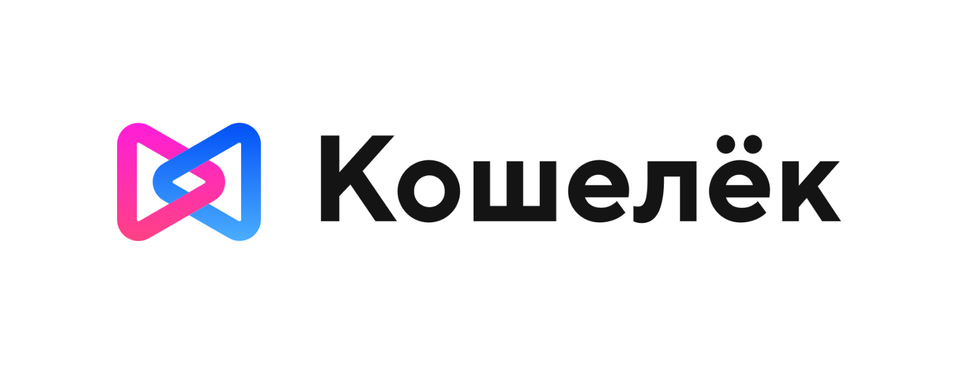
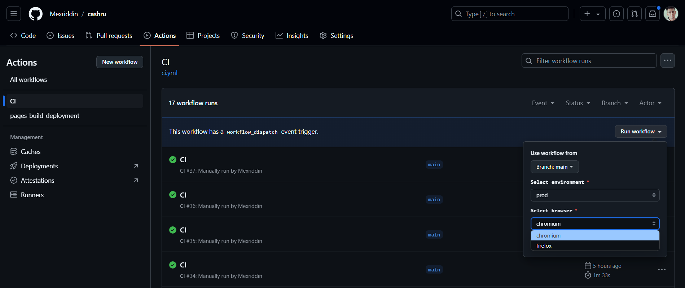
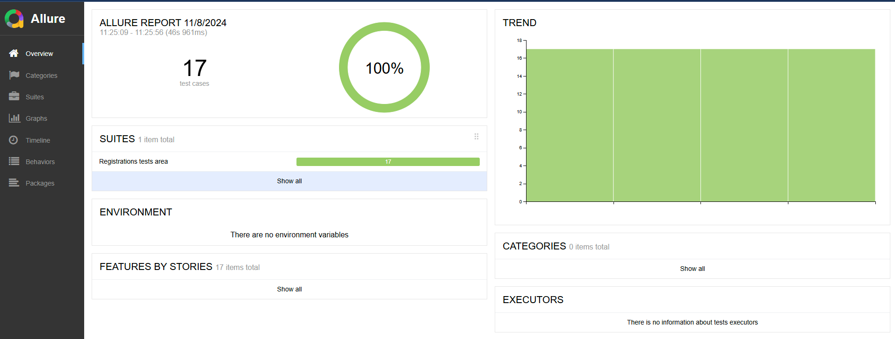
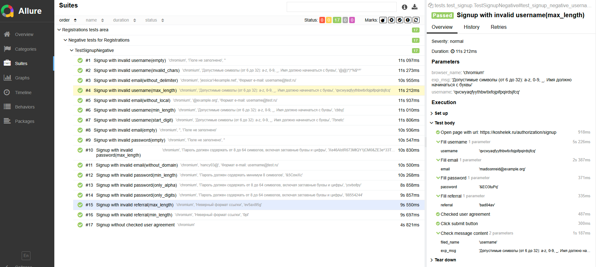

# Проект по автоматизации тестирования приложения Кошелёк.ру

<br>
<p align="center">

</p>
<br>

##  📌Содержание:

- [Использованный стек технологий](#tools)
- [Реализованные проверки](#checks)
- [Требования для использование](#requirements)
- [Инструкция запуск тестов](#test_run)
- [Сборка в GitHub Action](#github-action)
- [Пример Allure-отчета](#allure_report)

<h2 id="tools">Использованный стек технологий</h2>

<p align="center">
<code><a href="https://www.python.org/"></a></code>
<code><a href="https://www.jetbrains.com/pycharm/"></a></code>
<code><a href="https://docs.pytest.org/"></a></code>
<code><a href="https://playwright.dev/python/"></a></code>
<code><a href="https://allurereport.org/"></a></code>
<code><a href="https://github.com/"></a></code>
<code><a href="https://docs.github.com/ru/actions"></a></code>
</p>


**Автотесты написаны на `Python` с использованием фреймворк `Playwright`.**
- `Pytest` - для запуска тестов.
- `Playwright` - для выполнения тестов для UI
- `GitHub Action` - CI/CD для удаленного выполнения тестов.
- `Allure Report` - для визуализация результатов теста.

**Allure-отчет включает в себя**:
* шаги выполнения тестов;
* скриншот экрана в момент подение автотеста;


 <h2 id="checks">Реализованные проверки </h2>
 
- **Негативные проверки регистрация пользователя с невалидными:**
  - [x] *Поля "Имя пользователя"*
  - [x] *Поля "Электронная почта"*
  - [x] *Поля "Пароль"*
  - [x] *Поля "Реферальный код"*

<h2 id="requirements">Требование</h2>

Клонируйте код проекта с помощью команды:
```sh
 git clone https://github.com/Mexriddin/cashru.git
```
* Установите Python версии 3.12:  https://www.python.org/downloads/

* Для создания виртуальное окружение, перейдите в директорию проекта и выполните:
```sh
 python -m venv env
```
Активация
*  Чтобы начать пользоваться виртуальным окружением, необходимо его активировать:
```sh
 venv\Scripts\activate.bat - для Windows
 ```
```sh
 source venv/bin/activate - для Linux и MacOS
``` 
Установка зависимости
*  Чтобы установить зависимости проекта в виртуальное окружение, необходимо выполнить:
```sh
 pip install -r .\requirements.txt
 ```
```sh
 playwright install
 ```


<h2 id="test_run">Инструкция запуск тестов</h2>
Запуск тестов можно осуществлять локально или с помощью <a href="https://github.com/Mexriddin/cashru/actions/workflows/ci.yml"> GitHub Actions</a> с формированием Allure-отчета прогона.

**С возможностью выбора окружение и браузер**
### Локальный запуск тестов

* в .env определить параметры конфигурации:

    - `STAGE`*(prod,dev)*

```sh
  pytest .\tests\ 
```
При необходимости можно переопределить параметры запуска
```
pytest --browser=chromium           - запуск с выбором в каком браузере(chromium, firefox, webkit)
pytest -n=4                         - запуск параллельно в 4 потоках
pytest -v                           - запуск с дополнительным информациям
pytest --alluredir=allure-results   - c генирированием Allure отчета
```
### Запуск тестов с помощью Docker
Запускаем тесты в докер контейнере
```sh
docker-compose up run_tests
```
Генирируем Allure отчет
```sh
docker-compose up report
```

<h2 id="github-action"> <a href="https://github.com/Mexriddin/cashru/actions/workflows/ci.yml"> Сборка в GitHub Action</a></h2>
<h4>С возможностью выбора окружение и браузер</h4>
<p align="center">

</p>

<h2 id="allure_report"> <a href="https://mexriddin.github.io/cashru/">Пример Allure-отчета</a></h2>
<h4>Обзор</h4>

<p align="center">

</p>

### Результат выполнения теста

<p align="center">

</p>
